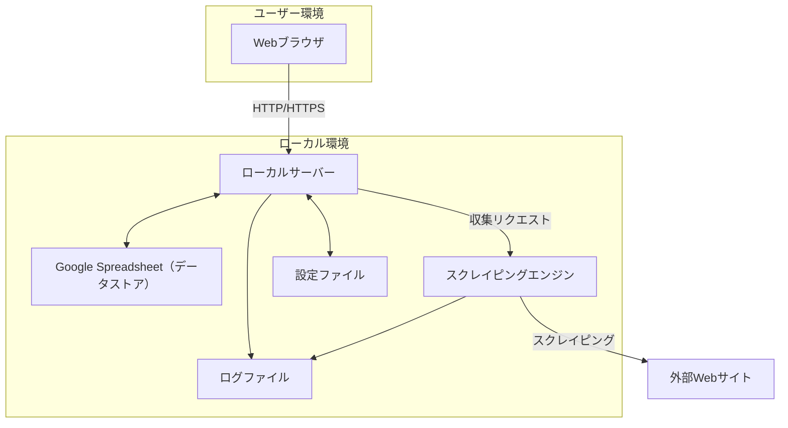
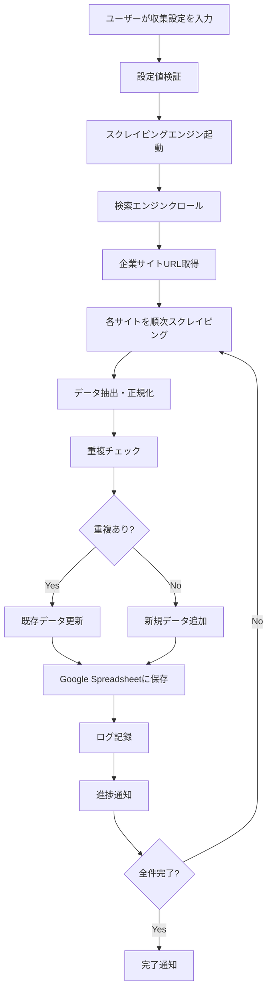

# 営業リスト作成ツール 基本設計書

## 1. 概要

本ドキュメントは「営業リスト作成ツール要件定義書」に基づき、ASPおよび広告代理店への営業活動を効率化するシステムの基本的な設計について記述するものです。

## 2. システム構成

本ツールはユーザーのPC上で動作するローカル環境のWebアプリケーションとして構築します。システム全体の構成は以下の通りです。



- **ローカルサーバー:** ユーザーのPC上で動作するアプリケーション。Webブラウザからアクセスして利用します。
- **Google Spreadsheet:** 企業情報やユーザーの営業活動ステータスを保存するデータストアとして利用します。
- **スクレイピングエンジン:** 指定されたWebサイトから企業情報を自動収集します。適切な間隔制御とUser-Agent設定機能を含みます。
- **設定ファイル:** 収集対象サイトやCSSセレクタなどの設定を管理します。
- **ログファイル:** データ収集の実行状況、成功・失敗・エラー内容を記録します。

## 3. 使用技術スタック

本ツール開発で使用する技術は以下の通りです。

- **フロントエンド:**
    - HTML5 / CSS3
    - JavaScript
    - **フレームワーク:** React.js または Vue.js
- **バックエンド:**
    - **言語:** Python
    - **フレームワーク:** FastAPI または Django
    - **ライブラリ:**
        - **スクレイピング:** Scrapy, BeautifulSoup4, Playwright
        - **Excel出力:** openpyxl
        - **CSV出力:** pandas
        - **Google Spreadsheet連携:** gspread, google-api-python-client
        - **ログ管理:** logging
        - **設定管理:** configparser, PyYAML
- **データストア:**
    - Google Spreadsheet（メインデータストア）
    - JSON/YAML（設定ファイル）
- **インフラ/デプロイ環境:**
    - ローカル実行環境
    - Docker（オプション）

## 4. データソース設計（Google Spreadsheet シート設計）

### 4.1. シート構成

Google Spreadsheetに以下のシートを作成します：

#### **Companiesシート（企業情報）**

| カラム名 | データ型 | 説明 | 必須 |
| :--- | :--- | :--- | :--- |
| id | INTEGER | ユニークID（行番号） | ○ |
| company_name | TEXT | 会社名 | ○ |
| url | TEXT | 企業サイトURL | ○ |
| address | TEXT | 住所（完全住所） | |
| postal_code | TEXT | 郵便番号 | |
| prefecture | TEXT | 都道府県 | |
| city | TEXT | 市区町村 | |
| address_detail | TEXT | 住所詳細 | |
| tel | TEXT | 電話番号 | |
| fax | TEXT | FAX番号 | |
| representative | TEXT | 代表者名 | |
| business_content | TEXT | 事業内容 | |
| established_date | TEXT | 設立年月日 | |
| capital | TEXT | 資本金 | |
| contact_url | TEXT | 問い合わせフォームURL | |
| source_url | TEXT | 情報収集元URL | |
| created_at | DATETIME | 作成日時 | ○ |
| updated_at | DATETIME | 更新日時 | ○ |

#### **SalesStatusesシート（営業ステータス管理）**

| カラム名 | データ型 | 説明 | 必須 |
| :--- | :--- | :--- | :--- |
| company_id | INTEGER | Companiesシートのid | ○ |
| status | TEXT | 営業ステータス（未着手/アプローチ中/商談中/成約/見送り） | ○ |
| memo | TEXT | 担当者やアプローチ内容などのメモ | |
| contact_person | TEXT | 担当者名 | |
| last_contact_date | DATE | 最終コンタクト日 | |
| next_action | TEXT | 次回アクション予定 | |
| updated_at | DATETIME | 更新日時 | ○ |

#### **CollectionLogsシート（収集ログ）**

| カラム名 | データ型 | 説明 |
| :--- | :--- | :--- |
| id | INTEGER | ログID |
| execution_date | DATETIME | 実行日時 |
| keyword | TEXT | 検索キーワード |
| target_sites | TEXT | 対象サイト |
| collected_count | INTEGER | 収集件数 |
| success_count | INTEGER | 成功件数 |
| error_count | INTEGER | エラー件数 |
| status | TEXT | 実行ステータス（成功/失敗/部分成功） |
| error_details | TEXT | エラー詳細 |

### 4.2. 重複排除ロジック

- **一次キー:** URL（企業サイトURL）
- **二次キー:** 会社名の正規化文字列（全角半角統一、スペース除去）
- 重複検出時は既存データを更新し、新しい情報で補完する

## 5. 画面設計（詳細ワイヤーフレーム）

### 5.1. メイン画面（企業リスト一覧）

**レイアウト構成:**
```
[ヘッダー: ツール名 | データ収集 | 設定 | ログ]
[検索・フィルターエリア]
  - キーワード検索ボックス
  - ステータス絞り込みドロップダウン
  - 地域絞り込みドロップダウン
  - 設立年絞り込み（範囲指定）
[アクションボタンエリア]
  - [新規追加] [CSV出力] [Excel出力] [重複チェック]
[データテーブル]
  - ページネーション対応（100件/ページ）
  - ソート機能（全カラム対応）
  - インライン編集機能
  - 各行に [編集] [削除] [ステータス更新] ボタン
```

### 5.2. データ収集設定画面

**レイアウト構成:**
```
[収集設定フォーム]
  - 検索キーワード入力（複数対応）
  - 対象業界選択（チェックボックス）
  - 対象地域選択（都道府県）
  - 収集サイト選択（求人サイト、プレスリリースサイト等）
  - 詳細設定（収集間隔、最大件数）
[実行ボタンエリア]
  - [収集開始] [設定保存] [テスト実行]
[進捗表示エリア]
  - プログレスバー
  - 現在の処理状況
  - 収集済み件数/総件数
[ログ表示エリア]
  - リアルタイムログ表示
  - エラー詳細表示
```

### 5.3. ステータス管理画面

**機能:**
- 企業ごとの営業ステータス一括更新
- 営業進捗の可視化（ダッシュボード）
- フォローアップ予定の管理

## 6. 処理フロー

### 6.1. データ収集フロー



### 6.2. エラーハンドリングフロー

- **ネットワークエラー:** 3回リトライ後、スキップしてログ記録
- **パースエラー:** エラー詳細をログに記録し、次の処理に継続
- **Google Spreadsheet API エラー:** 一時的な保存領域に退避し、復旧後に同期

## 7. セキュリティ・パフォーマンス設計

### 7.1. スクレイピング制御

- **アクセス間隔:** 1リクエスト/秒（設定可能）
- **User-Agent:** 設定ファイルで管理、ランダムローテーション対応
- **リクエスト制限:** 1サイトあたり最大100ページまで
- **タイムアウト:** 30秒/リクエスト

### 7.2. パフォーマンス要件

- **目標処理速度:** 100件/30分以内
- **UI応答性:** 3秒以内（10,000件データ）
- **メモリ使用量:** 最大512MB

### 7.3. データ保護

- **Google Spreadsheet:** OAuth2認証による安全なアクセス
- **ローカルデータ:** 設定ファイルの暗号化オプション
- **ログ:** 個人情報のマスキング処理

## 8. 設定管理

### 8.1. 設定ファイル構成

```yaml
# config.yaml
scraping:
  interval: 1  # seconds
  timeout: 30  # seconds
  max_pages_per_site: 100
  user_agents:
    - "Mozilla/5.0 (Windows NT 10.0; Win64; x64) AppleWebKit/537.36"
    # 他のUser-Agent

target_sites:
  job_sites:
    - name: "求人サイトA"
      base_url: "https://example-job.com"
      selectors:
        company_name: ".company-name"
        address: ".company-address"
  # 他のサイト設定

google_sheets:
  spreadsheet_id: "your-spreadsheet-id"
  credentials_file: "credentials.json"
```

### 8.2. 動的設定変更

- Web画面からの設定変更機能
- 設定変更の即座反映
- 設定履歴の管理

## 9. ログ・監視

### 9.1. ログレベル

- **INFO:** 正常処理の記録
- **WARNING:** 軽微な問題（データ不備等）
- **ERROR:** 処理エラー
- **CRITICAL:** システム停止レベルのエラー

### 9.2. ログ出力先

- **ファイル:** logs/scraping.log（日付ローテーション）
- **Google Spreadsheet:** CollectionLogsシート
- **Web画面:** リアルタイム表示

