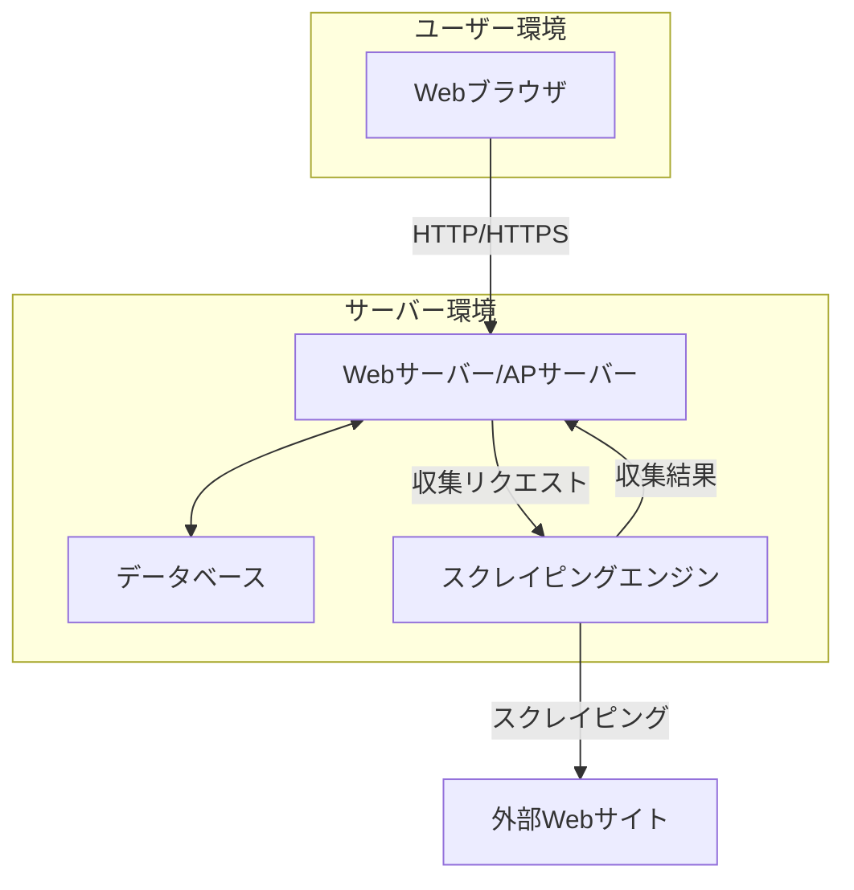
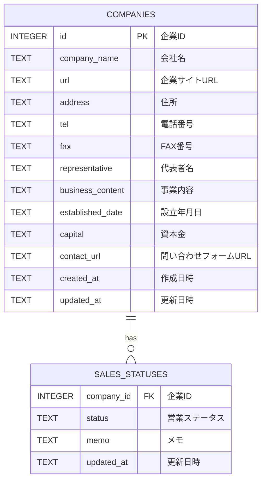

# 営業リスト作成ツール 基本設計書

## 1. 概要

本ドキュメントは「営業リスト作成ツール要件定義書」に基づき、システムの基本的な設計について記述するものです。

## 2. システム構成

本ツールは、ユーザーがWebブラウザから利用するWebアプリケーションとして構築します。システム全体の構成は以下の通りです。

- **Webサーバー/APサーバー:** ユーザーからのリクエストを受け付け、画面表示やビジネスロジックを実行します。スクレイピングエンジンに対してデータ収集を指示します。
- **データベース:** 収集した企業情報やユーザーの営業活動ステータスなどを保存します。
- **スクレイピングエンジン:** Webサーバーからの指示に基づき、実際に外部のWebサイトをクロール・スクレイピングして情報を収集します。

## 3. 使用技術スタック

本ツール開発で使用する技術は以下の通りです。

- **フロントエンド:**
    - HTML5 / CSS3
    - JavaScript
    - **フレームワーク:** React.js または Vue.js
- **バックエンド:**
    - **言語:** Python
    - **フレームワーク:** FastAPI または Django
    - **ライブラリ:**
        - **スクレイピング:** Scrapy, BeautifulSoup4, Playwright
        - **Excel出力:** openpyxl
- **データベース:**
    - SQLite (開発用) / PostgreSQL (本番用)
- **インフラ/デプロイ環境:**
    - Docker
    - Heroku または AWS (EC2, RDS)

## 4. データベース設計

### 4.1. ER図

### 4.2. テーブル定義

#### COMPANIES (企業情報テーブル)

| カラム名 | データ型 | 説明 |
| :--- | :--- | :--- |
| id | INTEGER | 主キー、自動採番 |
| company_name | TEXT | 会社名 |
| url | TEXT | 企業サイトURL |
| address | TEXT | 住所 |
| tel | TEXT | 電話番号 |
| fax | TEXT | FAX番号 |
| representative | TEXT | 代表者名 |
| business_content | TEXT | 事業内容 |
| established_date | TEXT | 設立年月日 |
| capital | TEXT | 資本金 |
| contact_url | TEXT | 問い合わせフォームURL |
| created_at | DATETIME | 作成日時 |
| updated_at | DATETIME | 更新日時 |

#### SALES_STATUSES (営業ステータス管理テーブル)

| カラム名 | データ型 | 説明 |
| :--- | :--- | :--- |
| company_id | INTEGER | 企業ID (COMPANIES.idへの外部キー) |
| status | TEXT | 営業ステータス (未着手, アプローチ中など) |
| memo | TEXT | 担当者やアプローチ内容などのメモ |
| updated_at | DATETIME | 更新日時 |

## 5. 画面設計（簡易ワイヤーフレーム）

### 5.1. リスト一覧画面

- **レイアウト:**
    - 上部に検索・フィルタリングエリアを配置。
    - メインエリアに企業情報の一覧をテーブル形式で表示。
    - 各行に編集・削除ボタンを配置。
- **機能:**
    - キーワード検索、ステータスによる絞り込み。
    - CSV/Excelエクスポートボタン。
    - 新規データ追加ボタン。

### 5.2. データ収集設定画面

- **レイアウト:**
    - データ収集のトリガーとなるボタンを配置。
    - 収集キーワードや対象業種などを入力するフォームを配置。
    - 収集の進捗状況を表示するエリアを配置。
    - 収集ログを表示するエリアを配置。

## 6. 処理フロー

### 6.1. データ収集フロー

1.  ユーザーがデータ収集設定画面からキーワードなどを入力し、収集開始ボタンを押す。
2.  Webサーバーはリクエストを受け付け、スクレイピングエンジンに収集を依頼する。
3.  スクレイピングエンジンは、指定されたキーワードでWeb検索を行い、企業サイトのURLリストを取得する。
4.  取得したURLリストを一つずつ巡回（クロール）し、各ページから企業情報を抽出（スクレイピング）する。
5.  抽出したデータをデータベースの`COMPANIES`テーブルに保存する。その際、URLを元に重複チェックを行う。
6.  処理が完了したら、Webサーバーに通知し、ユーザー画面に進捗と結果を表示する。 